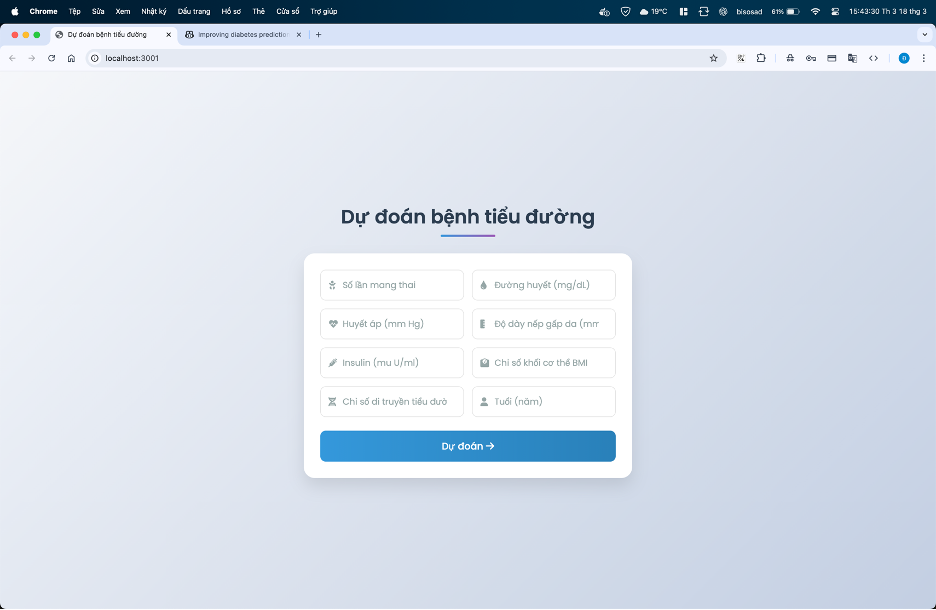
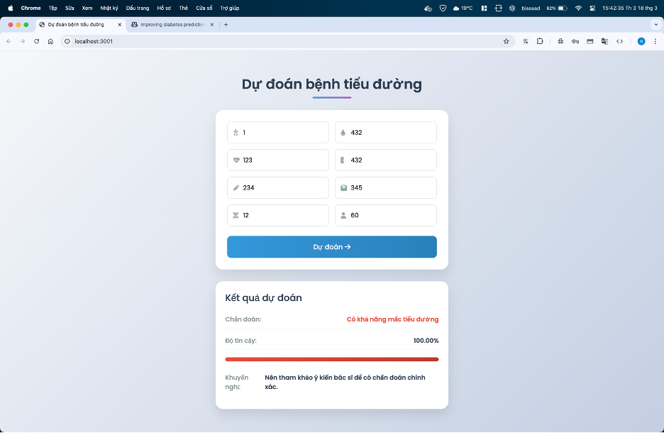

## 🚀 **Diabetes Prediction Project**  

### 📌 **Mô Tả**  
Dự án này sử dụng **Flask API** để dự đoán bệnh tiểu đường dựa trên thông tin y tế của người dùng.  
- **Backend:** Flask + TensorFlow/Keras (Deep Learning).  
- **Frontend:** Node.js + Express + HTML/CSS/JavaScript.  
- **Triển khai:** Hỗ trợ Docker để chạy trên mọi hệ thống dễ dàng.  

---

## 📋 **Cấu Trúc Dự Án**  
```plaintext
diabetes_project/
├── docker-compose.yml        # Cấu hình Docker Compose
├── backend/                  # API Flask
│   ├── app.py                # Flask API endpoints
│   ├── diabetes_model.keras  # Mô hình đã huấn luyện
│   ├── scaler.pkl            # Bộ chuẩn hóa dữ liệu
│   ├── train_model.py        # Script huấn luyện model
│   ├── Dockerfile            # Cấu hình Docker cho backend
│   └── requirements.txt      # Thư viện Python cần thiết
└── frontend/                 # Giao diện người dùng
    ├── server.js            # Server Express (Node.js)
    ├── Dockerfile           # Cấu hình Docker cho frontend
    ├── package.json         # Cấu hình npm
    └── public/              # Static files
        ├── index.html       # Giao diện chính
        ├── script.js        # JavaScript xử lý client
        └── style.css        # CSS styling
```

---

## 🚀 **Hướng Dẫn Cài Đặt**  

### **🔹 Cách 1: Sử Dụng Docker (Khuyến nghị)**  
Cách này giúp cài đặt nhanh chóng và chạy ứng dụng trên mọi hệ thống:  
1. Cài đặt **[Docker](https://www.docker.com/get-started)** và **Docker Compose**.  
2. Clone dự án và di chuyển vào thư mục dự án:  
   ```bash
   git clone <repository_url>
   cd diabetes_project
   ```
3. Khởi chạy ứng dụng với Docker Compose:  
   ```bash
   docker-compose up --build
   ```
4. Truy cập ứng dụng tại: **http://localhost:3001**  

---

### **🔹 Cách 2: Cài Đặt Thủ Công**  

#### **1️⃣ Cài Đặt Backend (Flask)**
```bash
cd backend
pip install -r requirements.txt
python app.py
```
👉 **Backend sẽ chạy tại:** `http://localhost:5001`  

#### **2️⃣ Cài Đặt Frontend (Node.js)**
```bash
cd frontend
npm install
node server.js
```
👉 **Frontend sẽ chạy tại:** `http://localhost:3001`  

---

## 🔍 **Cách Sử Dụng**  
1. Mở trình duyệt và truy cập: **[http://localhost:3001](http://localhost:3001)**  
2. Nhập thông tin y tế của bệnh nhân:  
   - Số lần mang thai  
   - Nồng độ glucose trong máu  
   - Huyết áp tâm trương  
   - Độ dày nếp gắp da  
   - Lượng insulin trong huyết thanh  
   - Chỉ số khối cơ thể (BMI)  
   - Chỉ số di truyền tiểu đường  
   - Tuổi  
3. Nhấn nút **"Dự đoán"** để nhận kết quả phân tích.  

---

## 🌐 **API Endpoints**  

| HTTP Method | Endpoint          | Mô tả |
|------------|------------------|-------------------------------|
| **GET**    | `/`              | Kiểm tra trạng thái API       |
| **POST**   | `/predict`       | Nhận dữ liệu và trả về kết quả dự đoán |
| **GET**    | `/model_info`    | Thông tin về mô hình (debug) |
| **GET**    | `/scaler_info`   | Thông tin về bộ chuẩn hóa dữ liệu (debug) |

---

## 🔄 **Huấn Luyện Lại Mô Hình**  
```bash
cd backend
python train_model.py
```
👉 **Mô hình mới sẽ được lưu lại trong `diabetes_model.keras`**  

---




## 🎯 **Tác Giả & Đóng Góp**  
📌 **Tác giả:** *Bisosad*  

🔥 **Hãy ⭐ star repository nếu bạn thấy hữu ích!** 🚀  

